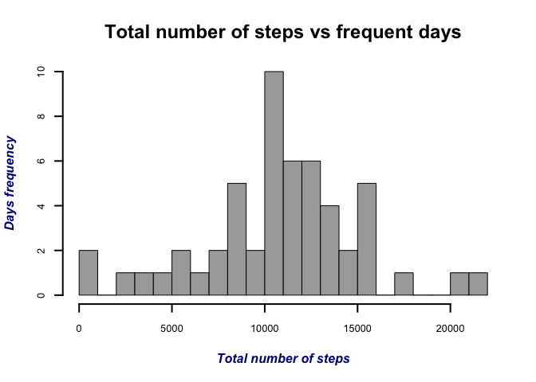
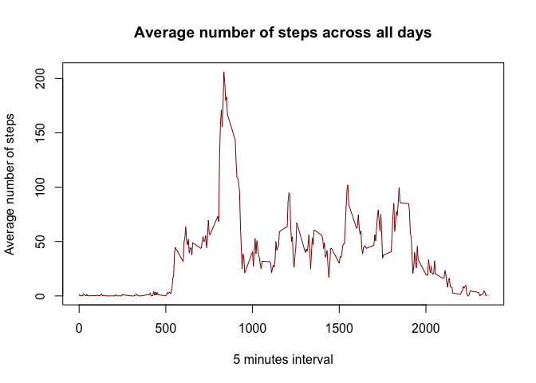
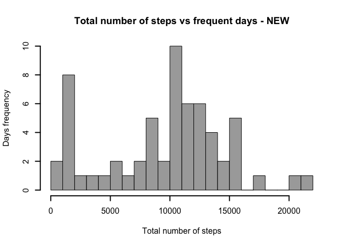
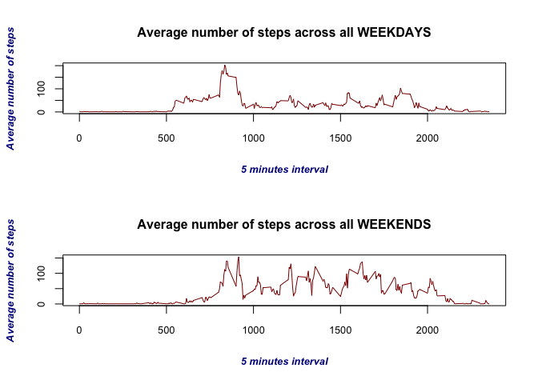

# Reproducible Research: Peer Assessment 1


## Loading and preprocessing the data
Here you load the input data and format the character column to represent the class "Date":

```r
rawfile <- read.csv(file = "activity.csv")
rawfile$date <- as.Date(rawfile$date,format="%Y-%m-%d")
```


## What is mean total number of steps taken per day?
To calculate the total number of steps taken per day, the function **aggregate** is used:

```r
steps_sum <- aggregate(steps ~ date ,data = rawfile, sum,na.action = NULL)
```

Next, the histogram of total number of steps taken per day is plotted:


```r
#Define the plot styles
par(#Set to one plot per window
    mfrow=c(1,1),
    # Change the colors
    col.main="black", col.lab="dark blue",
    # Titles in italic and bold
    font.main=2, font.lab=4,
    # Change font size
    cex.main=1.5, cex.lab=1, cex.axis=0.8,
    # End style of the lines
    lend = 2)
#Plot the histogram
hist(steps_sum$steps, 
     breaks = 20,
     main = "Total number of steps vs frequent days",
     xlab = "Total number of steps",
     ylab = "Days frequency", 
     col = "dark grey",
     lwd = 2)
```

 

Now, calculating the **MEAN** and **MEDIAN** total number of steps per day:


```r
#Mean total number of steps taken per day
total_steps_mean <- mean(steps_sum$steps,na.rm = TRUE)
mean_print<-paste("The MEAN total number of steps taken per day is:",total_steps_mean)
print(mean_print)
```

```
## [1] "The MEAN total number of steps taken per day is: 10766.1886792453"
```

```r
#Median total number of steps taken per day
total_steps_median <- median(steps_sum$steps,na.rm = TRUE)
median_print<-paste("The MEDIAN total number of steps taken per day is:",total_steps_median)
print(median_print)
```

```
## [1] "The MEDIAN total number of steps taken per day is: 10765"
```


## What is the average daily activity pattern?
You calculate the number of steps taken in each 5 min interval averaged across all days using **aggregate** function as follows:

```r
daily_pattern<-aggregate(steps ~ interval, data = rawfile, mean)
```
Then, you plot the averaged steps time-series:

```r
plot(daily_pattern,type = "l",
     main = "Average number of steps across all days",
     xlab = "5 minutes interval",
     ylab = "Average number of steps", 
     col = "dark red")
```

 

To find the 5 minute interval which has the maximum number of steps, it was used the following expression:

```r
max_steps_interval<-daily_pattern$interval[daily_pattern$steps == max(daily_pattern$steps)]
max_steps<-paste("The maximum number os steps in a 5 minute interval is",max_steps_interval,"steps")
print(max_steps)
```

```
## [1] "The maximum number os steps in a 5 minute interval is 835 steps"
```


## Imputing missing values
First you need to calculate the total number of rows with NAs

```r
NA_rows<-is.na(rawfile$steps)
total_rows_na<-length(rawfile$steps[NA_rows])
```

Secondly, you need to adopt a strategy for filling the missing values: 
in this case it will be adopted the mean value of the overall total number of steps taken per interval per day.  
Now, it is necessary to create a new dataset filling the NA's by the total mean steps per day:  

```r
newdata<-rawfile
```
And then, define the new total steps taken per day:

```r
intervals_per_day<-max(newdata$interval,na.rm=TRUE) #find the number of intervals per day
mean_steps_per_interval<-total_steps_mean/intervals_per_day #calculate the mean number of steps per interval
newdata$steps[is.na(newdata$steps)]<-mean_steps_per_interval #set the mean number of steps into NA's
steps_sum_new <- aggregate(steps ~ date ,data = newdata, sum) # recalculate the total number of steps per date
```

The new histogram is plot below:

```r
hist(steps_sum_new$steps, 
     breaks = 20,
     main = "Total number of steps vs frequent days - NEW",
     xlab = "Total number of steps",
     ylab = "Days frequency", 
     col = "dark grey",
     lwd = 2)
```

 


Calculating the **NEW** mean/median total steps taken per day:

```r
#The NEW MEAN Total steps taken per day
total_steps_mean_new <- mean(steps_sum_new$steps,na.rm = TRUE)
mean_print<-paste("The NEW total MEAN steps taken per day is:",total_steps_mean_new)
print(mean_print)
```

```
## [1] "The NEW total MEAN steps taken per day is: 9526.90222210839"
```

```r
#The NEW MEDIAN Total steps taken per day
total_steps_median_new <- median(steps_sum_new$steps,na.rm = TRUE)
median_print<-paste("The NEW total MEDIAN steps taken per day is:",total_steps_median_new)
print(median_print)
```

```
## [1] "The NEW total MEDIAN steps taken per day is: 10395"
```


## Are there differences in activity patterns between weekdays and weekends?
You need to set the weekdays and weekends in the new data set so, it is necessary to find the weekdays and the weekends among the dates:

```r
week_vector<-weekdays(newdata$date)
day_type<-rep("weekday",length(week_vector))
for(i in 1:length(week_vector)){
    if(week_vector[i]=="Sunday"){day_type[i]<-"weekend"}
    if(week_vector[i]=="Saturday"){day_type[i]<-"weekend"}
}
```

Later, you need to add the vector of *the type of day* together with the original dataset, and, calculate the number of steps taken in each 5 min interval averaged across all **WEEKDAYS** and **WEEKENDS**:

```r
#Merging the vector
newdata_w<-cbind(newdata,day_type)
#Number of steps taken in each 5 min interval averaged accross all WEEKDAYS
weekdays_pattern<-aggregate(steps ~ interval, 
                            data = newdata_w[newdata_w$day_type=="weekday",], mean)
#Number of steps taken in each 5 min interval averaged accross all WEEKDEND
weekends_pattern<-aggregate(steps ~ interval, 
                            data = newdata_w[newdata_w$day_type=="weekend",], mean)
```

Finally you can plot the averaged steps in time-series for WEEKDAYS and WEEKENDS:

```r
#Set the panel plot
par(#Define plot panel
    mfrow=c(2,1),
    # Change the colors
    col.main="black", col.lab="dark blue",
    # Titles in italic and bold
    font.main=2, font.lab=4,
    # Change font size
    cex.main=1, cex.lab=0.8, cex.axis=0.8,
    # End style of the lines
    lend = 2)
#Plot the averaged WEEKDAYS steps in time-series
plot(weekdays_pattern,type = "l",
     main = "Average number of steps across all WEEKDAYS",
     xlab = "5 minutes interval",
     ylab = "Average number of steps", 
     col = "dark red")
#Plot the averaged WEEKENDS steps in time-series
plot(weekends_pattern,type = "l",
     main = "Average number of steps across all WEEKENDS",
     xlab = "5 minutes interval",
     ylab = "Average number of steps", 
     col = "dark red")
```

 

